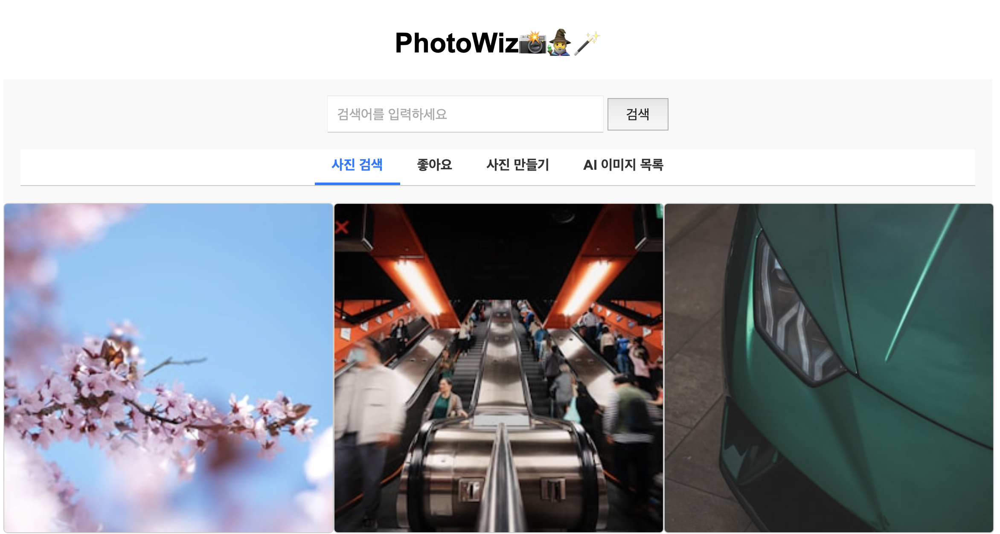
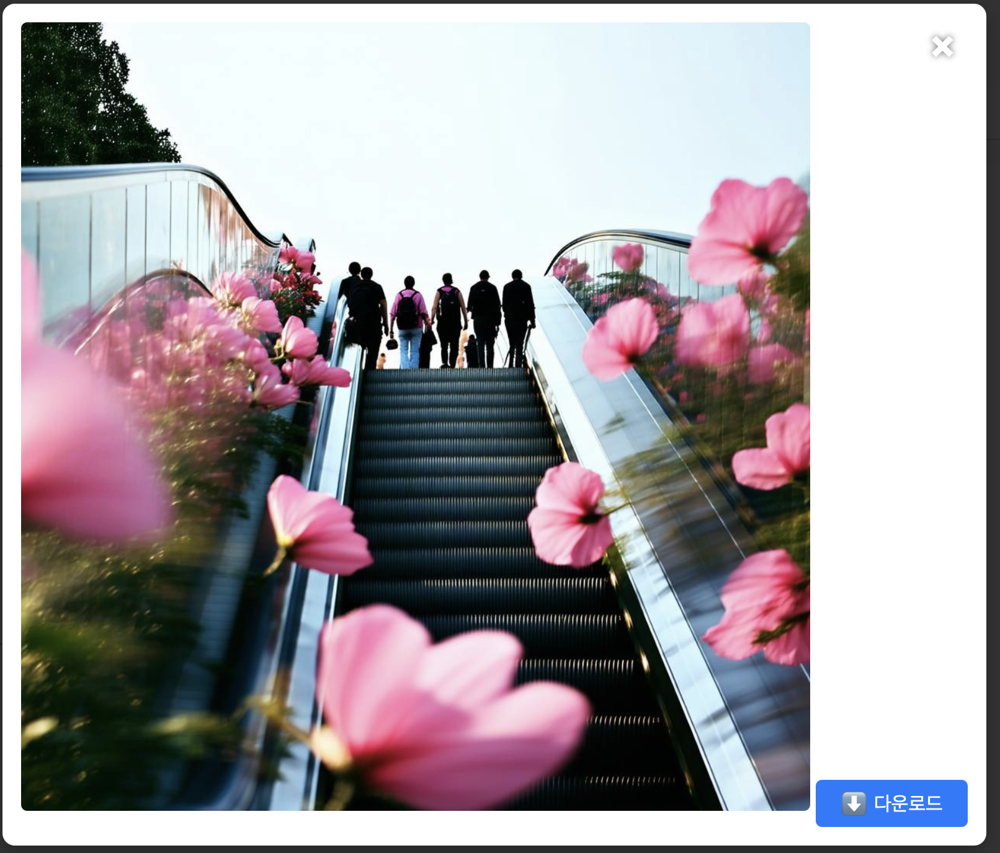

# PhotoWiz🪄📸🧙‍♂️

**PhotoWiz**는 사용자들이 Hugging Face의 Stable Diffusion 모델을 사용하여 AI 기반 이미지를 생성하고, Unsplash에서 고품질 사진을 검색할 수 있는 풀스택 웹 애플리케이션입니다. 이 프로젝트는 강력한 API를 통합하여 원활하고 인터랙티브한 갤러리 경험을 제공합니다.

## 목차

- [기능](#기능)
- [사용 기술](#사용-기술)
- [데모](#데모)
- [라이브 배포](#라이브-배포)
- [주의사항](#주의사항)
- [사전요구사항](#사전요구사항)
- [서버깨우기](#서버깨우기)

## 기능

- **이미지 검색:** Unsplash에서 사진을 애플리케이션 내에서 직접 검색 및 탐색.
- **AI 이미지 생성:** Hugging Face의 Stable Diffusion 모델을 사용하여 사용자 프롬프트에 기반한 고유한 이미지 생성.
- **반응형 디자인:** 다양한 디바이스에 최적화되어 데스크탑, 태블릿, 모바일에서도 원활한 사용자 경험 제공.
- **다이나믹 갤러리:** 생성된 이미지와 검색된 이미지를 잘 정리된 갤러리 레이아웃으로 표시.
- **에러 처리:** 문제 발생 시 사용자에게 친절한 에러 메시지 제공.

## 사용 기술

- **프론트엔드:**
  - HTML5
  - CSS3
  - JavaScript (ES6)

- **백엔드:**
  - Node.js
  - Express.js
  - Axios
  - CORS
  - dotenv

- **API:**
  - [Hugging Face Inference API](https://huggingface.co/inference-api)
  - [Unsplash API](https://unsplash.com/developers)

- **배포:**
  - [Render.com](https://render.com/)

- **개발 도구:**
  - nodemon

## 데모
*PhotoWiz의 작동 모습 미리보기.*

- **사진 검색(초기 화면):** 

- **생성된 ai이미지:**

## 라이브 배포s

Render.com에서 실시간으로 PhotoWiz를 경험해보세요:

[**라이브 데모 보기**](https://photowiz.onrender.com)

## 주의사항

Render 배포서비스는 장시간 미이용시, 첫 로딩시간이 약 30초 정도 소요됩니다.

Ai이미지 생성은 보통 10~30초 정도 소요됩니다.

## 사전요구사항

- **Node.js & npm:** Node.js (v14 이상)와 npm이 설치되어 있어야 합니다. [여기](https://nodejs.org/)에서 다운로드할 수 있습니다.

## 서버깨우기

	•Cron-job.org를 통해 2분마다 Http요청을 보내고 있습니다.
